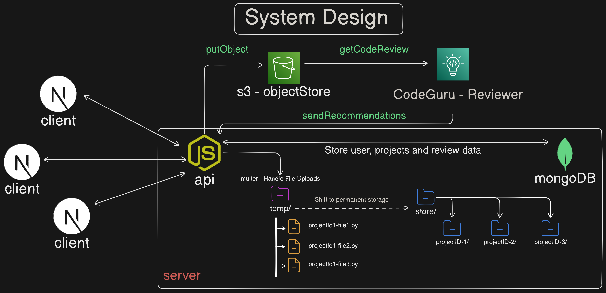

# Efficient CodeReview Automation Tool (Server)
This project is a tool designed to upload Python, Java or Javascript projects to AWS's Codeguru Reviewer Service and provide Security and Code Quality recommendations for the user.
This repository contains the backend server for the project that connects to Codeguru Reviewer and MonogoDB.

>NOTE: This server can only run on a Linux file-system.

Tech Stack : `Node.js` `Express.js` `MongoDB` `AWS-CodeGuru` `AWS-S3`

**Frontend Repository link**[here](https://github.com/IAmRiteshKoushik/coderev-web).

## Overview


- The server accepts files from the frontend, zips and stores the zipped file in `AWS S3` repositories. 
- Meanwhile, it also inserts the corresponding records in the `user` and `project` collections of the database.
- Next, Code Review is initiated and the recommendations are fetched, and these details are inserted in the database.
- The frontend acceses all relevent details from the database via  routes in the backend server that handle them.

## About Codeguru Reviewer
`Codeguru` is an AWS service that leverages program analysis and machine learning to identify potential defects and to recommend best practices.
Improve the maintainability and security of your Java and Python codebase with AWS CodeGuru Reviewer. 

This project uses the `AWS Javascript SDK v3(Typescript)` to access Codeguru and other AWS services.

For more details, visit the [AWS Codeguru Reviewer Documentation](https://docs.aws.amazon.com/codeguru/)

## Other AWS Services
`Amazon S3` Amazon Simple Storage Service is a service offered by Amazon Web Services that provides object storage through a web service interface. The S3 repository serves as the provider from which the Codeguru Reviewer accesses the source code.

For more details, visit the [AWS S3 Documentation](https://docs.aws.amazon.com/AmazonS3/latest/API/Welcome.html))


## Requirements

- Operating System : Linux / MacOS
- [Node Installation](https://nodejs.org/en/download)
- [AWS Account](https://aws.amazon.com/?nc2=h_lg)
- [MongoDB Account](https://www.mongodb.com/) Use Atlas (cloud service) or Compass (local machine)

## Getting Started

1. Clone this  repository into your local Linux environment.
2. Configure the `.env` file with the required values such as your AWS credentials.
3. cd to the destination folder
4. Install dependencies:

```bash
npm install
```
5. Run the development server:
```bash
# Should run in on PORT 5000 by default
npx esrun src/index.ts
```
> Open the localhost port configured by you in your browser to see the server 
running. By default it should be `http://localhost:5000/`

## Team Members

1. [Amruta Varshini](https://github.com/varshiniert) : Front-end Developer
2. [Dhaksana R](https://github.com/Dhaksana) : Front-end Developer
3. [Ritesh Koushik](https://github.com/IAmRiteshKoushik) : Full-Stack Developer
4. [Sudharsan Vanamali](https://github.com/Astrasv) : Back-end Developer
5. [Senthil Adithya V](https://github.com/a-dithya04) : Back-end Developer
